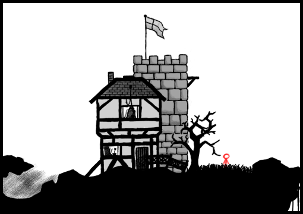
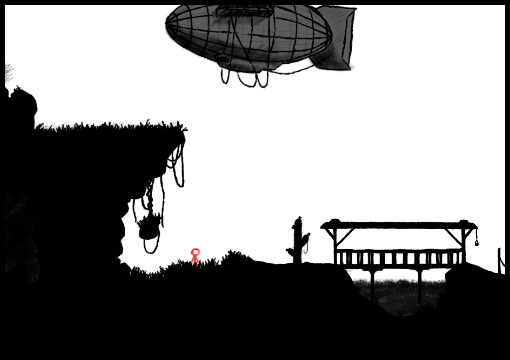
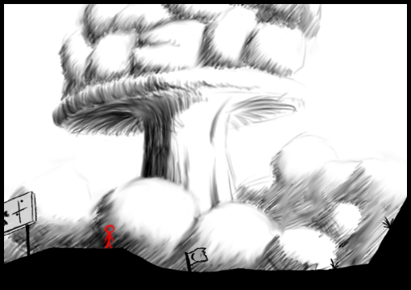

# BildBesucher

## Online Version
Das Spiel kann auf [quoteme.github.io/bildbesucher/](https://quoteme.github.io/bildbesucher/)
online gespielt werden.

## Bildschirmfotos

## Idee
In dem Spiel geht es darum, dass man eine Zeichnung erstellt,
welche aus zwei (bzw drei) Teilen besteht.

1. Die Hauptzeichnung (welche aus Vorder & Hintergrund besteht)
2. Die Kollisionszeichnung

Vielleicht werden noch weitere Kategorien hinzusgefügt, doch
hauptsächlich geht es darum, dass man in dem Spiel einen Charakter
erstellt, mit dem man in der Lage ist von einer Zeichnung in die
Nächste zu springen/klettern/laufen/... und dabei die gezeichneten
Welten zu erkunden.

## Ausführung
- Clientside
	1. Der Client verbindet sich mittels eines Browsers mit dem
		Host des Spiels
	2. Die URL wird [entschlüsselt](#url-entschlüsselung)
		- Welche Skizze wird geladen
		- Welche Attribute hat der Spieler
		- ...
	3. Das Level wird geladen
		- Lade die Skizze
		- Lade die Kollisionsdatei
	4. Der Spieler wird hinzugefügt
	5. Update das Spiel
		- Verändere die Geschwindigkeit des Spielers
			- mittels Tastatur
			- durch Gravitation
		- Prüfe nach Kollisionen
			- Spieler-Welt : Ermittle Winkel von Spielermitte
			 	zu Kollisionspunkt und reflektiere Geschwindigkeit
			- Spieler-Portal : wechsle URL/Level
		- Ändere Position des Spielers nach Geschwindigkeit
- Serverside
	1. Erstelle Skizze (bunt/schwarz-weiß) und Kollisionsdatei (schwarz-weiß)
	2. Speichere Skizze und Kollisionsdatei als
		"NAME-v.png", "NAME-h.png" und "NAME-k.png" unter "/level"
	3. Erstelle einen Link für dieses Level

##### URL Entschlüsselung

###### Skizze

| ID | Default | Bedeutung |
|----|---------|-----------|
| v  | Lade den Vordergrund der default Skizze | URL zum Vordergrund der Skizze |
| h  | Lade den Hintergrund der default Skizze | URL zum Hintergrund der Skizze |
| k  | Lade die Kollisionsdatei der default Skizze | URL zu der Kollisionsdatei |

###### Spieler

##### Objekte

###### Level

Eine Skizze stellt ein Level oder eine Zeichnung da, auf welcher sich
ein Spieler bewegen kann.

| Attribut | Eigenschaft |
|----------|-------------|
| Vordergrund | Das Bild, welches den Vordergrund darstellt |
| Hintergrund | Das Bild, welches den Hintergrund darstellt |
| kollision | Das Bild, welches die Kollisionsdatei darstellt |
